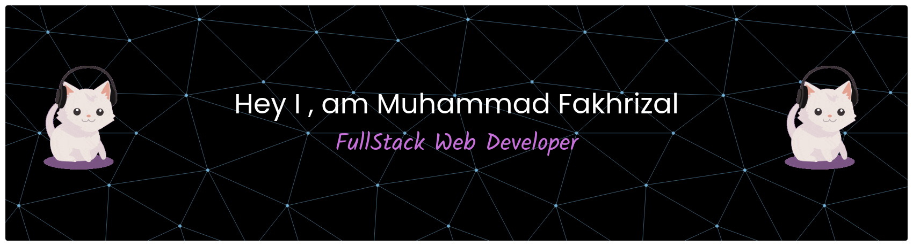

<!-- Animated Typing -->

<!-- Banner -->

---

## 👋 Hello World!

### I'm Muhammad Fakhrizal Garnindyo, a 🚀 Fullstack Developer passionate about building modern and scalable web applications. I have experience with **Next.js, React.js, Node.js, Express.js, and PHP Laravel** for backend development, and work with databases like **MySQL, PostgreSQL, and MongoDB**. I love exploring new technologies, crafting efficient solutions, and contributing to open source projects.

---

# 🧰 Tech Stack

---

---

# 🧠 What I'm Doing

- 🔭 I’m currently working on web applications with **Next.js and Laravel**
- 🌱 I’m currently learning advanced **Node.js patterns** and **microservices architecture**
- 👯 I’m looking to collaborate on **open source projects** or **innovative web apps**
- 🤔 I’m looking for help with **scaling backend systems** and **optimizing database performance**
- 💬 Ask me about **fullstack development, JavaScript or PHP frameworks, or database design**
- 📫 How to reach me: **fakhrizalgarnindyo@gmail.com**
- 😄 Pronouns: **He/Him**
- ⚡ Fun fact: I enjoy exploring new **tech stacks** and building side projects just for fun!

---

# 💻 Developer Fun Zone

⚡ Debugging code • ☕ Coffee powered coding • 🚀 Deploying apps  
🌐 Building scalable web apps • 🧠 Solving complex problems • 🔥 Loving open source

---

# 🌐 Connect With Me

